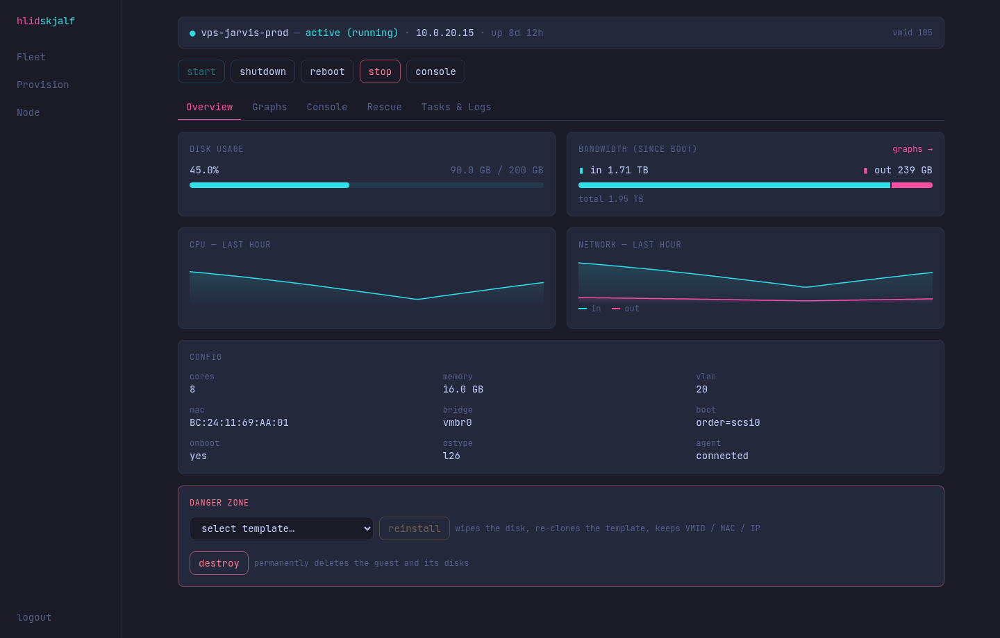
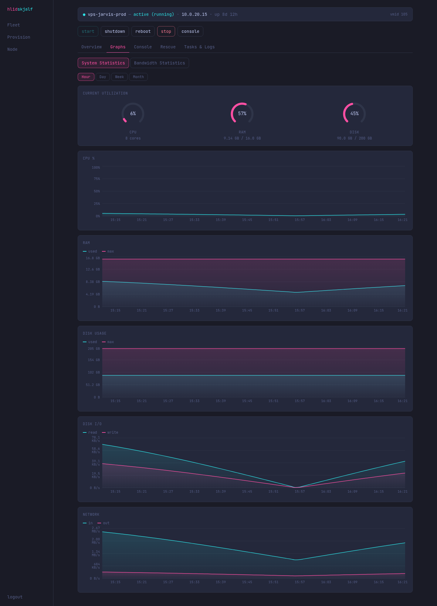
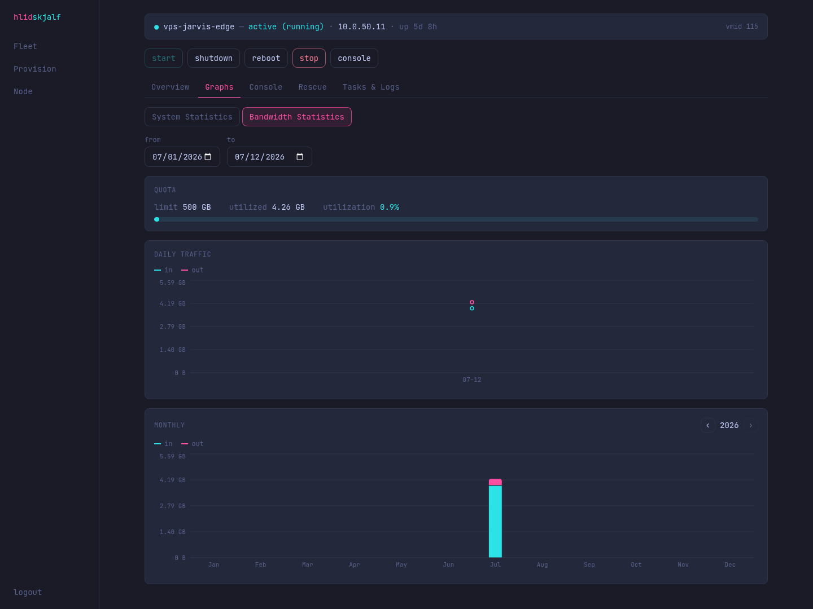
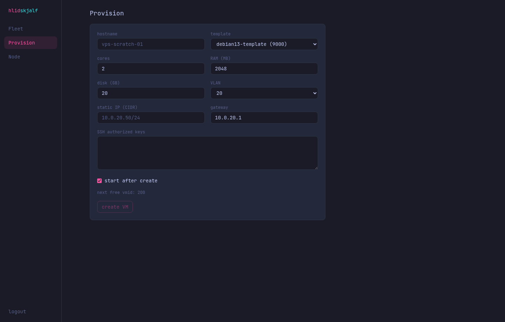
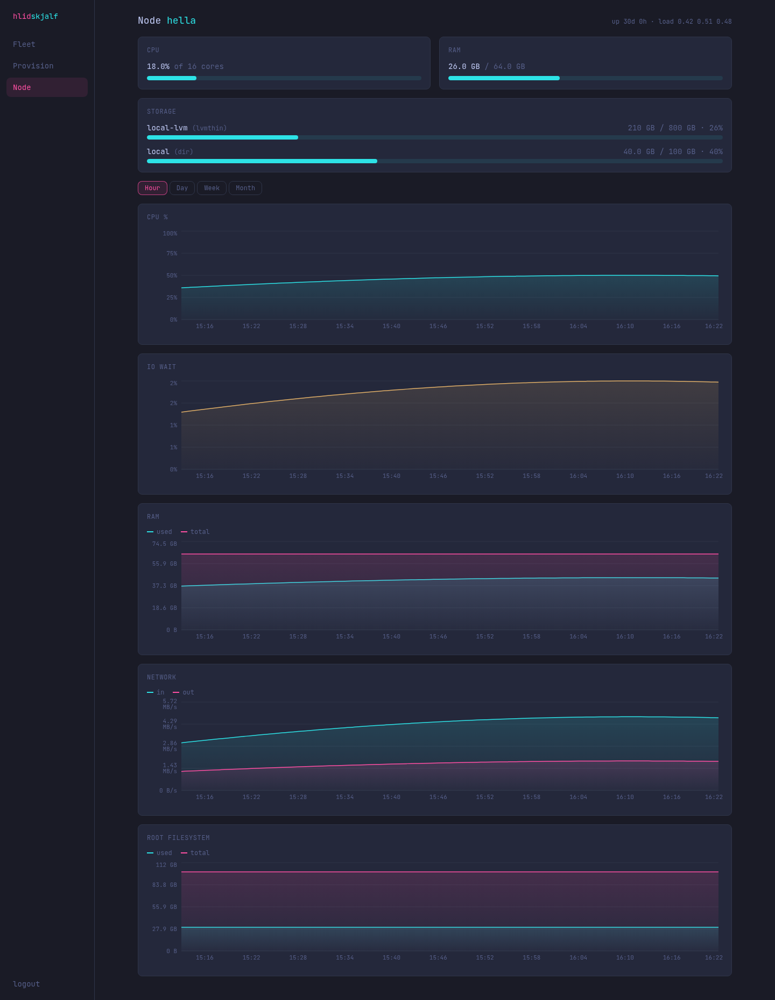
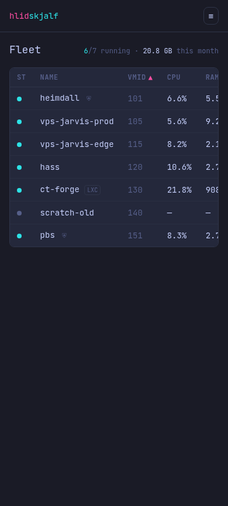

# 🖥️  RACK 47 — LIVE FEEDS  |  v0.2-alpha

```
  [ CYBERPUNK SERVER ROOM ]
  ┌────────────────────────────────────────────────────────────┐
  │  STATUS:  v0.2-alpha  [ALPHA]   NEON: CYAN #2DE2E6 / PINK #FF4FA3
  │  LOCATION: Sublevel Tokyo Night  |  RACK: 47  |  POWER: STABLE
  │  FEED:  Mock PVE (dev/mock_pve.py)  |  TIME:  LIVE
  └────────────────────────────────────────────────────────────┘
```

> The panel glows in the dark. Cyan and pink light the cable runs.  
> You are watching the control surface from inside the server room.

---

## MONITOR 01 — FLEET OVERVIEW

**Every VM/LXC at a glance.** Status dots pulse. Traffic counters tick.  
Quick power actions from the rack console.


---

## MONITOR 02 — VM OVERVIEW

**Systemd-style status line.** Copy-on-click IPs. Disk bars.  
Since-boot bandwidth. CPU & network sparklines. Danger zone with name confirmation.



---

## MONITOR 03 — SYSTEM STATISTICS

**Gauges + timeframe charts.** CPU, RAM, Disk, I/O, Network.  
Humanized units. Real-time feel from the rack.



---

## MONITOR 04 — BANDWIDTH STATISTICS

**Per-VM accounting.** Quota cards. Daily stacked area.  
Jan–Dec monthly bars. Cyan in, pink out.



---

## MONITOR 05 — PROVISION

**Cloud-init cloning.** VLAN + static IP. SSH keys.  
Watch the task log light up as the new guest spins up in the rack.



---

## MONITOR 06 — NODE STATUS

**The node's own vitals.** CPU/RAM/Storage. Host RRD graphs.  
The hypervisor itself, viewed from the control room.



---

## MONITOR 07 — MOBILE RACK ACCESS

The fleet table remains usable even when you're jacked in from a handheld terminal.



---

```
  ╔══════════════════════════════════════════════════════════╗
  ║   END OF FEED  |  NEON STABLE  |  v0.2-alpha             ║
  ║   "The lights never sleep in the server room."           ║
  ╚══════════════════════════════════════════════════════════╝
```

All images captured against the bundled mock.  
Back to rack index: [../README.md](../README.md) | Main control: [../../README.md](../../README.md)