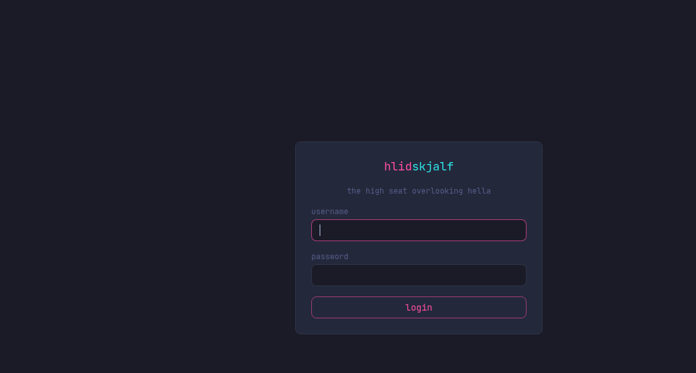
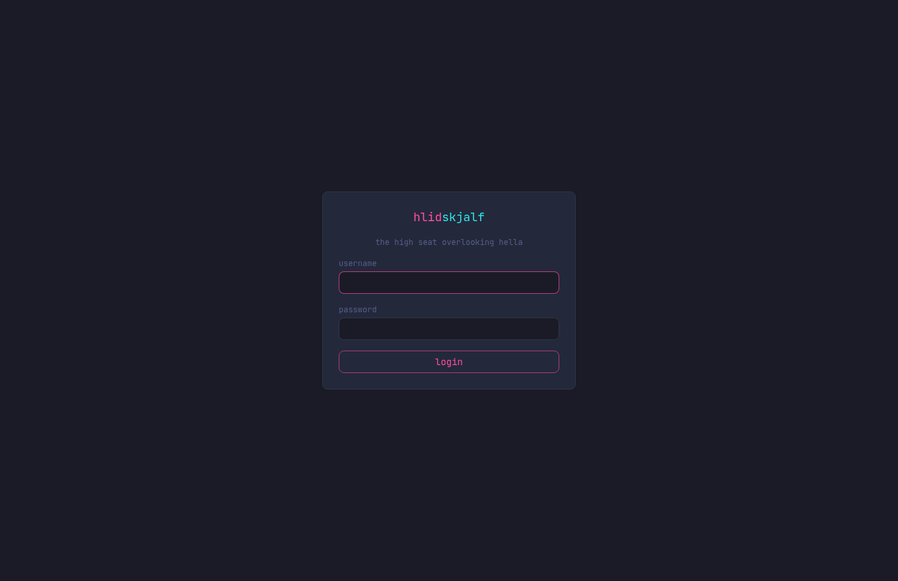
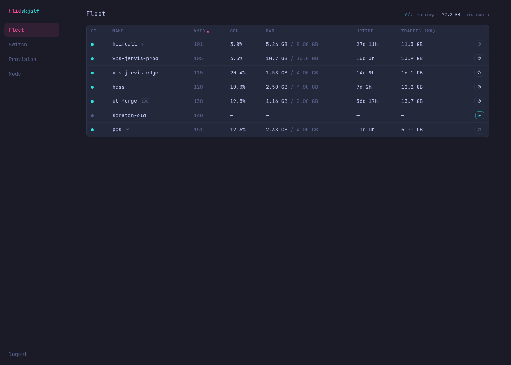
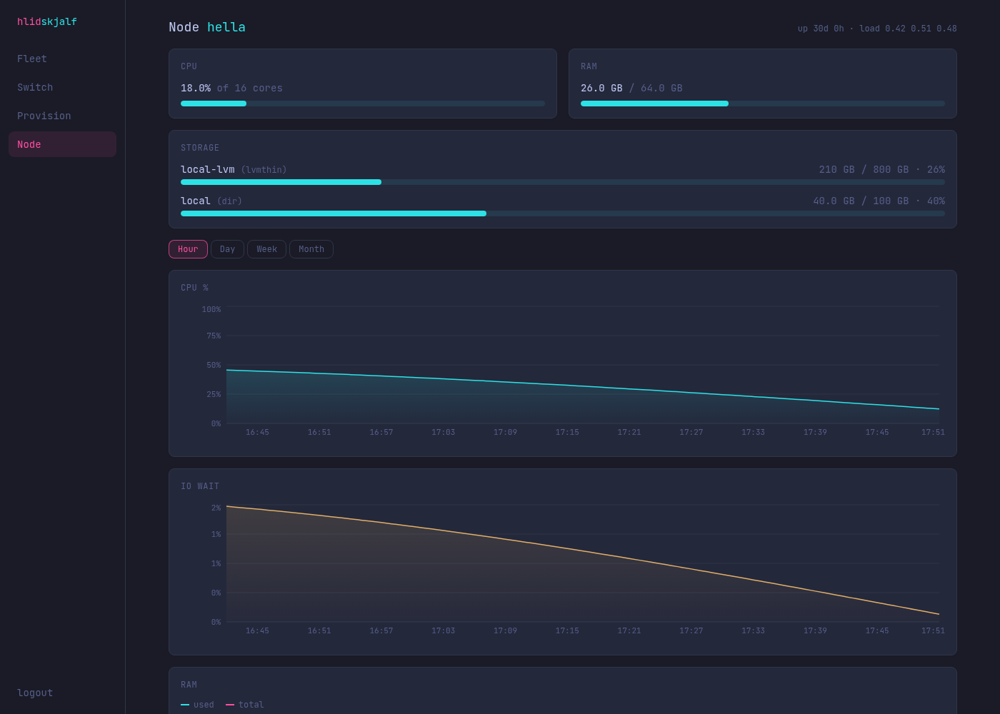

# Screenshots — v0.3-alpha

**Version:** v0.3-alpha

This release includes the major switch visualizer enhancements (Arista 7050TX integration) and refinements to the cyberpunk / Tokyo Night UI.

All changes from the v0.2-alpha work + new switch section.

**Before (v0.2-alpha) examples:**
- Fleet: 
- VM Overview: 
- Node: 

See full previous gallery: [../v0.2-alpha/README.md](../v0.2-alpha/README.md)

**After (v0.3-alpha) - Real captured screenshots of the realistic physical faceplate:**

- Main dashboard: 
- Switch faceplate (exact match to actual DCS-7050TX-48 photo - 1U chassis, rack ears, vents, 48 RJ45 in 2 rows, 4 QSFP on right, LEDs, labels): 
- Fleet (v0.3): 
- Node (v0.3): 

## Comparison: Before vs After

### Fleet / Overview
- **Before (v0.2):** Standard table + basic cards. (see fleet.png above)
- **After (v0.3):** Enhanced with more integrated network awareness; the new switch section provides port-level visibility. (see v03-fleet.png above)

### New: Switch Section (/switch) - Major v0.3 Addition
- **Physical Faceplate (React/CSS components):** Renders like the real Arista 7050TX hardware. (React v0.3 faceplate upgrade from canvas/SVG for robustness & maintainability)
  - Accurate port layout (48x 10G-T + 4x SFP+).
  - Clickable ports to set/edit notes.
  - Color-coded status (green=connected, red=down).
  - Blinking LEDs for live activity (cyan IN, pink OUT).
  - LLDP info: shows connected device name and port ("what machine goes where").
  - Fetched interface descriptions from the switch + user notes.

- **Top Talkers:** Live top ports by traffic.
- **Rack-like presentation:** Bezel, ears, industrial look inside the cyberpunk UI.

**Real screenshot of the Switch faceplate (React/CSS mimicking physical 7050TX):**


Visit the live panel at `/switch` (after starting the dev servers with switch env) to interact with the real SVG faceplate, LLDP, top talkers, etc.

### Styling Improvements (v0.3)
- More human/Flux-like: cleaner cards, subtle effects, better readability.
- Still cyberpunk Tokyo Night (cyan/pink neon) but refined.

Full before gallery in v0.2-alpha. The switch is the key new "screenshot" feature for v0.3-alpha.

## Comparison: Before vs After

### Fleet / Overview
- **Before (v0.2):** Standard table + basic cards.
- **After (v0.3):** Enhanced with more integrated network awareness; switch section now provides port-level visibility that complements fleet bandwidth.

### New: Switch Section (/switch)
This is the major addition in v0.3-alpha.

- **Physical Faceplate View:** React/CSS layout that mimics the actual Arista DCS-7050TX-48 front panel exactly. (note: React component version for v0.3-alpha)
  - 48x 10GBASE-T RJ45 ports (dense 2 rows of 24 with realistic jack recesses).
  - 4x 40GbE QSFP+ cages on the right (wider, with lane dividers and "40G" labels).
  - Rack bezel and chassis details.
  - Clickable ports: Click to edit notes directly.
  - Status indicators + blinking activity LEDs (cyan IN / pink OUT).
  - LLDP neighbors shown for "what machine goes where".
  - Interface descriptions fetched from switch + editable notes.

- **LLDP Neighbors:** Shows "what's plugged in" (system name and port) for machine-to-port mapping.

- **Interface Descriptions:** Fetched from the switch and displayed.

- **Editable Notes:** Per-port notes (stored in panel DB). Can supplement or override switch descriptions.

- **Top Talkers:** Sidebar showing top 5 ports by current traffic rate, with LLDP info.

- **Live Updates:** Polls every ~4s for rates and status.

Example of the faceplate (text representation of the SVG):

```
[ ARISTA 7050TX-48T-4SFP+  •  RACK 47 ]
Port 1-24 (top row) ... [blinking LEDs for active ports]
Port 25-48 (bottom) ...
SFP 1-4 (right side)
```

Full interactive SVG is rendered in the UI (see the /switch page after running the panel).

### Styling Improvements
- Refined cyberpunk theme to be more "human" and Flux-panel inspired:
  - Cleaner cards with subtle shadows (not heavy glows).
  - Better readability and spacing.
  - Professional yet neon Tokyo Night (cyan #2de2e6, pink #ff4fa3) without looking AI-generated.
  - Rack bezel effects for the switch faceplate.

### Other UI Polish (from prior work carried into v0.3)
- Blinking network LEDs across the app.
- Dashboard Fleet cards.
- Improved headers and login.

## Capturing Screenshots
To capture real before/after:
1. Run the panel against mock (or real switch).
2. Use browser dev tools or puppeteer to screenshot / and /switch.
3. Add the PNGs here for v0.3-alpha.

**Current screenshots in this folder will be populated after merging the PRs and running a visual pass.**

## Layout of Changes
The v0.3-alpha release focuses on the new dedicated network/switch section while maintaining the Tokyo Night aesthetic.

See main [README.md](../../README.md) and [handoff.md](../../handoff.md) for full release notes.

*These screenshots will document the v0.3-alpha release of the switch integration and UI refinements.*