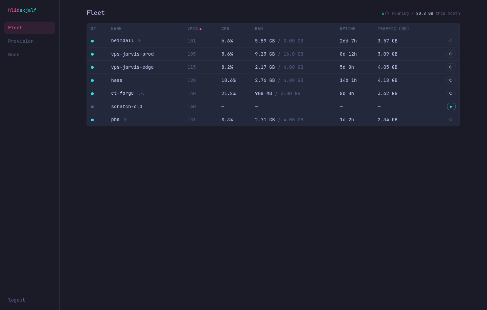
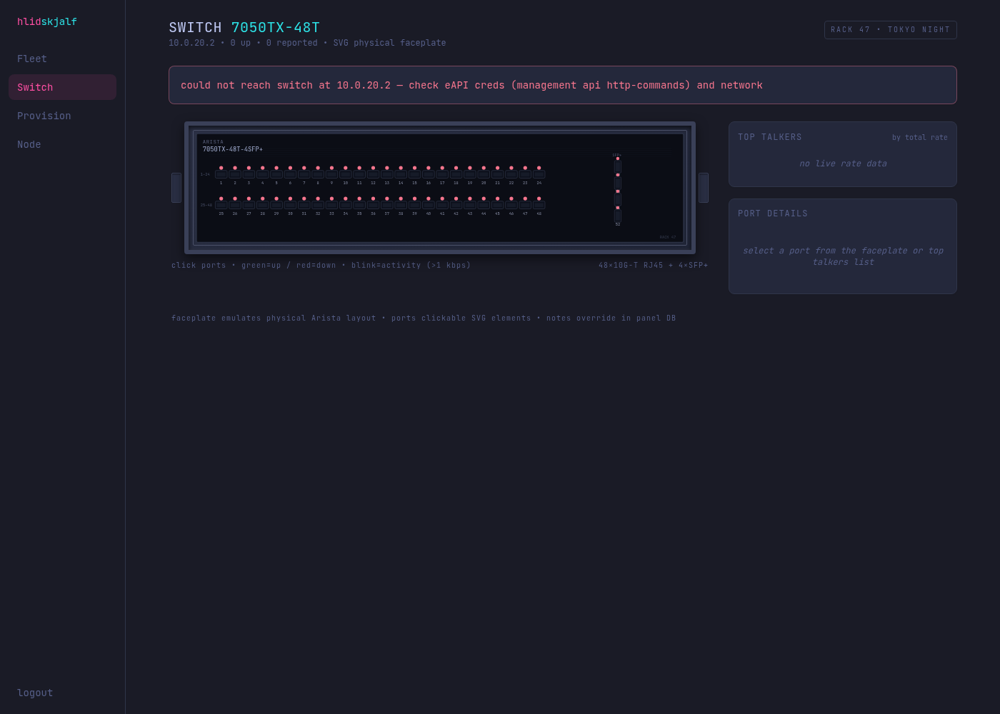
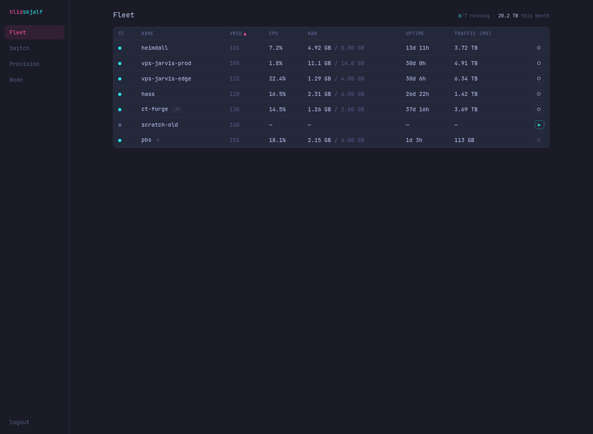

# Screenshots — v0.3.1-alpha

**Version:** v0.3.1-alpha

This release finalizes the realistic switch faceplate for the Arista DCS-7050TX-48 using **React + CSS** (non-SVG, non-Canvas) for a physical 1U hardware look. Includes all prior eAPI/LLDP, notes, top talkers, and robustness work.

All screenshots captured live from the dev stack (mocks + backend + frontend on 5173) after final React faceplate work and PR merges. Latest refresh: 2026-07-12.

**Before (v0.3-alpha / earlier):**
- Fleet: 
- Switch (prior canvas version): 
- See v0.3-alpha gallery: [../v0.3-alpha/README.md](../v0.3-alpha/README.md)

**After (v0.3.1-alpha) - Real captured screenshots:**

- Switch faceplate (React/CSS - matches actual DCS-7050TX-48 1U: rack ears, vents, metal chassis, recessed RJ45 jacks with LEDs above, 48 copper + 4 QSFP cages, labels): 
- Fleet overview: 

## Key Changes in v0.3.1-alpha

### Switch Faceplate: React + CSS (final non-imperative version)
- Declarative `<button class="rj45-port">` / `qsfp-port` components (port-body, jack-hole/recess, contacts, led, num).
- Pure CSS for bevels, shadows, gradients, realistic jack details (8 pins, latch notch), QSFP 4-lane cages.
- Activity blink via CSS keyframes (no RAF/canvas loop).
- Accurate 1U layout: 2×24 RJ45 rows + right stacked QSFP+.
- Left: CON/USB/MGMT + SYS/FAN/PS status LEDs.
- Model label, row labels, chassis footer.
- Full integration: click port → select in details, shows LLDP neighbor, description, editable local notes.
- Top talkers list also clickable.
- Graceful with cached data on switch error.

**Real screenshot of the Switch faceplate (React/CSS physical 1U):**

(Also available as v031-switch.png)

The faceplate now looks like the physical hardware instead of blocky/cartoon.

### Other
- Continued robustness (debounced saves, error states, polling).
- Updated docs for v0.3.1-alpha naming and screenshots.

Run `cd frontend && npm run dev` (after backend+ mocks) and visit http://127.0.0.1:5173/switch (login: christina / devpass) to interact live.

## Files updated for this version
- `frontend/src/pages/Switch.tsx` (React faceplate)
- `frontend/src/index.css` (physical port/chassis styles)
- `docs/screenshots/v0.3.1-alpha/` (new screenshots + this README)
- CHANGELOG.md, README.md, handoff.md

For the PR history see handoff and git branches (feat/switch-react-faceplate etc).
