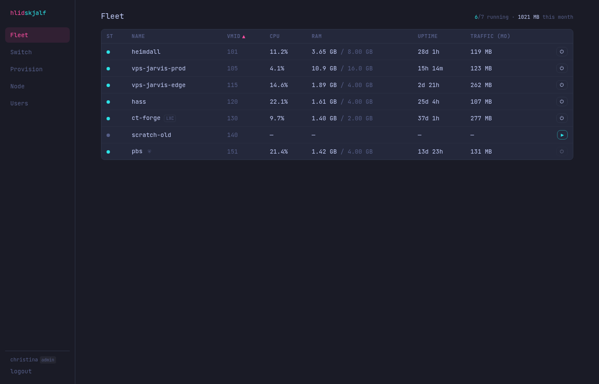
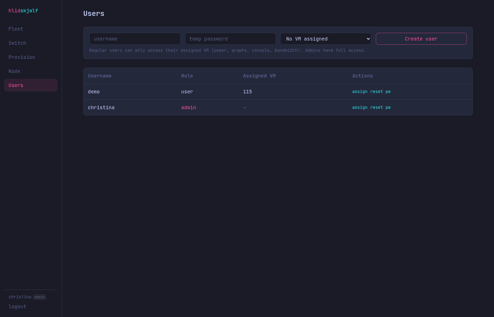
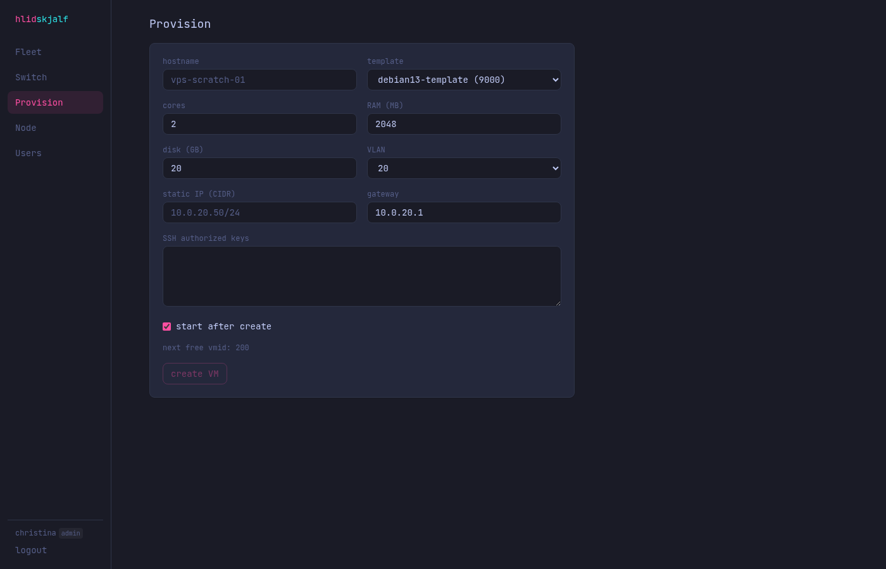
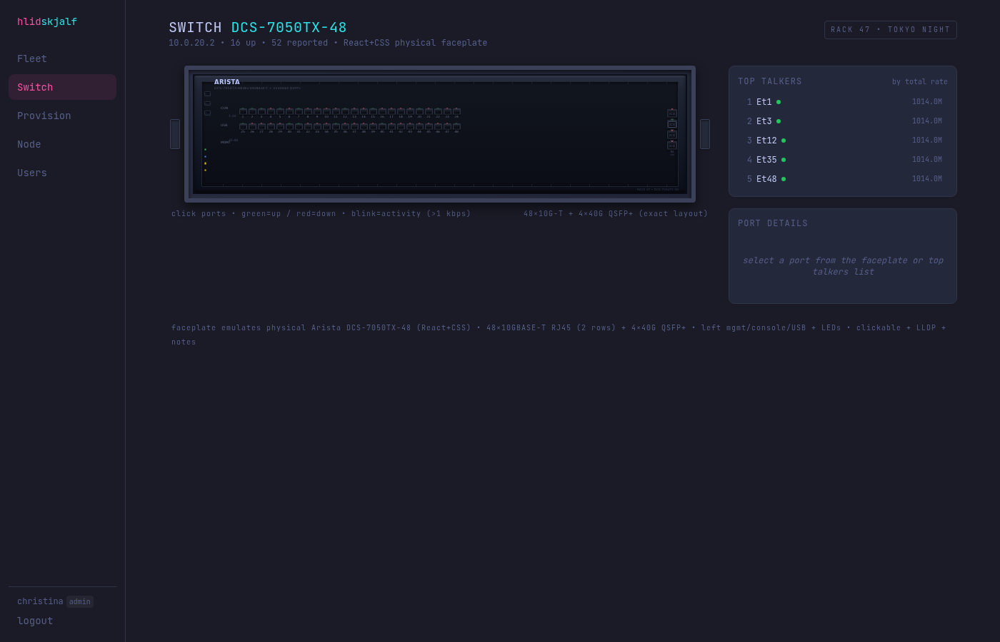
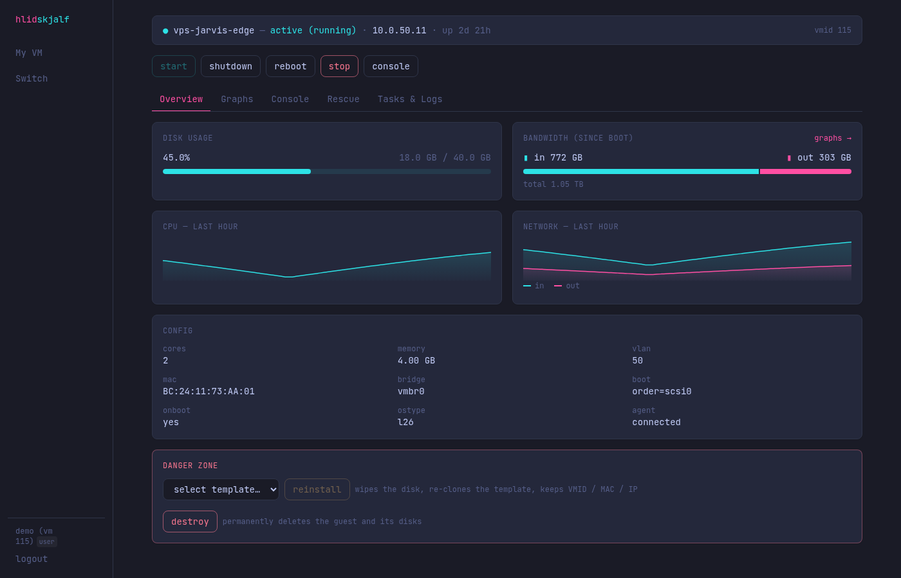
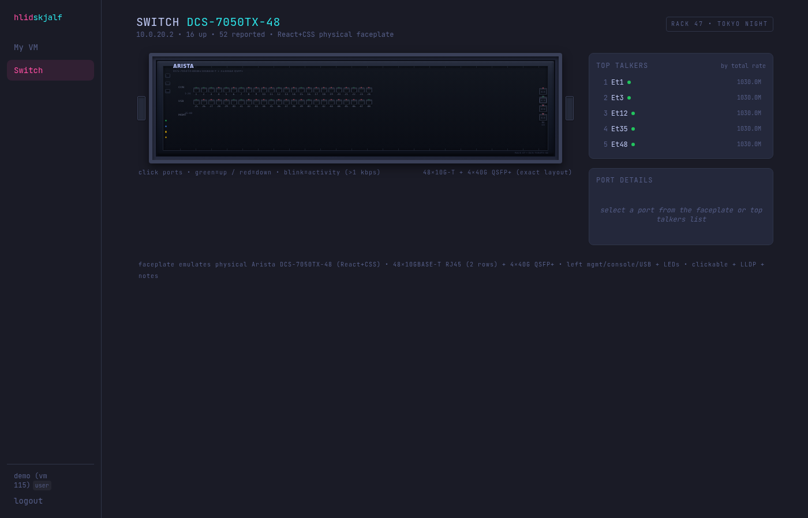

# Screenshots — v0.3.2-alpha

**Version:** v0.3.2-alpha

This release adds full **multi-user support** with distinct **Admin panel** and **User panel** (VPS hosting model). Regular users are each assigned exactly one VM and have scoped access only to their own VM's controls, graphs, bandwidth, console, and switch activity. Admins have full fleet control, provisioning, and user management.

All screenshots captured live from the dev stack (mock_pve + mock_switch + backend on 8787 + vite on 5173) after implementing the role-based UI, scoped APIs, Users admin page, and login flows. Latest: 2026-07-12.

**Before (v0.3.1-alpha):**
- Single-admin only experience.
- Full fleet visible to everyone.
- See previous: [../v0.3.1-alpha/README.md](../v0.3.1-alpha/README.md)

**After (v0.3.2-alpha) - New multi-user / VPS panels:**

### Admin Experience (admin / admin)
- Fleet overview with all VMs
- Provision new VMs
- **New Users management page**: create users, assign VM, reset passwords
- Full Switch faceplate + activity

### User Experience (e.g. "demo" user with one VM)
- Home redirects directly to "My VM"
- Limited nav: My VM + Switch (activity visibility)
- Full power control, graphs, bandwidth accounting, console, tasks for **only their VM**
- Cannot see other VMs, cannot provision

**Key new screenshots:**

- Admin Fleet: 
- Admin Users page (new): 
- Admin Provision: 
- Admin Switch activity: 
- User "My VM" view (single VM detail, VPS customer experience): 
- User Switch activity view: 

## Key Changes in v0.3.2-alpha

### Multi-User + Roles
- DB-backed users table (username, argon2 hash, role=admin|user, assigned vmid)
- Bootstrap: first run with old HLIDSKJALF_ADMIN_* env auto-creates initial admin
- Session now carries `role` + `vmid`
- Strict server-side scoping: regular users can only access their single VM for data/actions

### Admin Panel
- Full `/` = Fleet (list + quick actions)
- `/new` = Provision (create from template, assign IP/VLAN etc.)
- `/users` = New dedicated user management (create, assign VM from existing, reset pw)
- `/node` full access
- Switch notes editing

### User Panel (VPS-like)
- Each non-admin tied to **exactly one VM**
- Home auto-redirects to `/vm/{their-vmid}`
- All per-VM features work (power, overview, graphs, bandwidth monthly/daily with quotas, console noVNC, rescue, tasks)
- `/switch` visible for infrastructure activity (LLDP, rates, top talkers)
- No access to Fleet list of others, no Provision, no User mgmt

### API & Backend
- All list/detail/power/metrics/bandwidth endpoints now enforce ownership for non-admins
- New `/api/users`, `/api/me`, assign endpoints (admin-only mutations)
- `/api/vms` for users returns only their VM
- Provision, destroy, reinstall, global summaries, node: admin-only

### Flexibility for Remote Shipping
- Works out-of-the-box after setting PVE token + switch creds in env
- Minimal tweaking: run the stack; create users via UI and assign any existing VM
- Same PVE scoped token model + one service

Run the dev stack:
```bash
# mocks
cd dev && ../.venv/bin/uvicorn mock_pve:app --port 18006 &
cd dev && ../.venv/bin/uvicorn mock_switch:app --port 18080 --ssl-keyfile ... &

# backend + frontend
cd backend && (set -a; source ../dev/dev.env; set +a; ../.venv/bin/uvicorn hlidskjalf.main:app --port 8787 --reload &)
cd frontend && npm run dev
```

Login as admin (admin/devpass) → see full panels + Users tab.
Create a user + assign a VM → logout → login as that user → see minimal VPS panel.

## Files updated for this version
- backend/hlidskjalf/db.py (users table + methods + bootstrap)
- backend/hlidskjalf/auth.py (multi-user verify, get_current_user, role helpers)
- backend/hlidskjalf/main.py (richer login/session, seed bootstrap)
- backend/hlidskjalf/routes/{vms,provision,bandwidth,metrics,users,switch,rescue}.py (scoping + admin guards)
- frontend/src/App.tsx (role-aware routing + CurrentUser)
- frontend/src/components/Layout.tsx (dynamic nav per role, user badge)
- frontend/src/pages/{Users.tsx (new), Login.tsx, VmDetail.tsx, Fleet.tsx}
- frontend/src/api.ts (SessionInfo now includes role/vmid)
- Updated versions in pyproject.toml, package.json
- README.md, docs/screenshots/README.md → v0.3.2-alpha
- New `docs/screenshots/v0.3.2-alpha/` + this README + captures
- CHANGELOG.md, handoff.md (this release)

**To reproduce screenshots:** Use puppeteer against running dev stack (5173), login as admin then as demo user, navigate the different views, capture.

For the PR history see handoff.md.

---

**Live demo URLs (dev):**
- http://127.0.0.1:5173 (admin)
- Create user in /users, log in as them to see user panel.